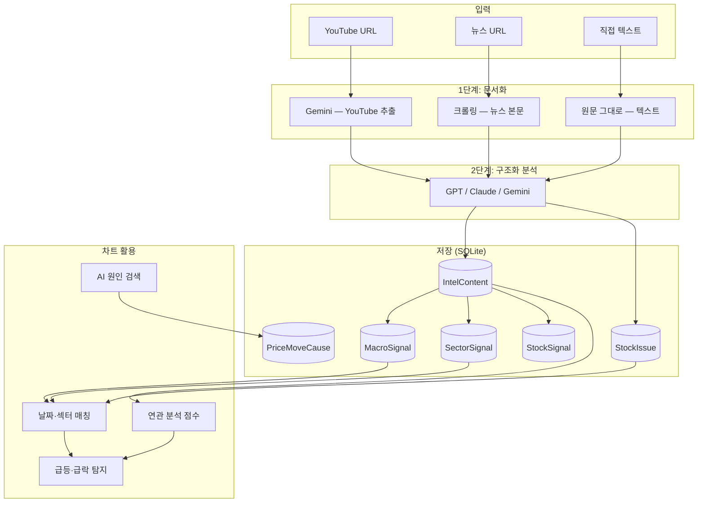

# StockMind AI 분석 · 저장 · 차트 연동 가이드

> 유튜브/텍스트 AI 분석 → DB 저장 → Signal 파생 → 차트 급변 구간 연결까지의 전체 흐름

---

## 1. 전체 아키텍처



**핵심 원칙**

| 원칙 | 설명 |
|------|------|
| 2단계 파이프라인 | YouTube는 Gemini로 **문서 추출** 후, 별도 AI로 **구조화 분석** |
| 원본 보존 | `IntelContent`는 삭제·수정하지 않음. Signal은 `content_id` 기준 재생성 |
| AI 호출 최소화 | Signal 파생은 **저장된 JSON 파싱만** (추가 AI 없음) |
| 동일 원인 단정 금지 | 섹터/매크로 공유는 **참고 맥락** 제공 (peer 종목 연결) |

---

## 2. AI 분석 방법

구현: `backend/core/ai_analyzer.py`

### 2.1 YouTube (2단계)

```
[자막 추출] → Gemini JSON 추출 → GPT/Claude/Gemini 구조화 → DB 저장
```

| 단계 | AI | 입력 | 출력 |
|------|-----|------|------|
| **1. 문서 추출** | Gemini (`gemini-3.1-flash-lite`) | 자막 최대 30,000자 (없으면 URL) | `{ title, document, speakers, topics }` |
| **2. 구조화 분석** | 사용자 선택 (기본 Gemini) | `document` 최대 20,000자 + 보유종목 목록 | summary, macro, sector, stock_issues 등 JSON |

**1단계 프롬프트 요점** (`YOUTUBE_EXTRACT_PROMPT`):

- `document`: 2,000자 이상, 마크다운 섹션 (`## 핵심 주장`, `## 섹터·종목` 등)
- 수치·종목명·경제 이벤트를 구체적으로 기록

**2단계 프롬프트 요점** (`_analysis_prompt_parts`):

- `summary`, `key_points`, `mentioned_stocks/sectors`, `keywords`
- `macro_analysis.topics[]` — 금리, 환율, CPI, FOMC 등
- `sector_analysis[]` — 섹터별 summary, outlook, mentioned_stocks
- `stock_issues[]` — **보유 종목** 중 언급된 것만 매핑

### 2.2 뉴스 URL

```
URL 크롤링(BeautifulSoup) → 본문 최대 30,000자 → 2단계 구조화 분석
```

### 2.3 직접 텍스트

```
입력 텍스트 → source_document로 저장 → 2단계 구조화 분석
```

### 2.4 API 엔드포인트

| 엔드포인트 | 용도 |
|-----------|------|
| `POST /api/intel/analyze` | 동기 분석 |
| `POST /api/intel/analyze/stream` | SSE 실시간 로그 |
| `POST /api/youtube/analyze` | 채널 탭 영상 분석 |
| `POST /api/intel/reanalyze/{id}` | **Gemini 재호출 없이** 2단계만 재실행 (`source_document` 재사용) |

### 2.5 캐시

- 동일 URL + `AI_SKIP_IF_CACHED=true` → DB 재사용
- `force_reanalyze=true` → AI 재호출

---

## 3. 저장 방법

구현: `backend/config/database.py`, `backend/core/ai_analyzer.py` → `_save_intel_content()`

### 3.1 IntelContent (원본 분석)

| 컬럼 | 내용 |
|------|------|
| `source_type` | `YOUTUBE` / `NEWS` / `TEXT` |
| `source_url`, `source_title`, `channel_name` | 출처 메타 |
| `source_document` | Gemini 추출문 또는 입력/크롤링 **원문** (최대 50,000자) |
| `summary` | AI 전체 요약 |
| `key_points` | JSON 배열 |
| `mentioned_stocks/sectors`, `keywords` | JSON 배열 |
| `macro_analysis`, `sector_analysis` | JSON |
| `sentiment` | POSITIVE / NEUTRAL / NEGATIVE |
| `analyzed_at` | 분석 시각 |

### 3.2 StockIssue (종목 ↔ 콘텐츠)

보유 종목(`Stock`)과 `IntelContent`를 연결:

- AI `stock_issues[]`에서 symbol/name 매칭
- fallback: `mentioned_stocks` 문자열에 종목명 포함 시 연결
- `issue_summary`, `sentiment` 저장 → **차트 급변 `intel` 원인**에 사용

### 3.3 Signal 테이블 (자동 파생)

저장 직후 `extract_signals()` 호출 (`backend/core/signal_extractor.py`):

| 테이블 | 출처 | 용도 |
|--------|------|------|
| **MacroSignal** | `macro_analysis.topics[]` | topic 정규화 (금리, 환율, CPI, FOMC…) |
| **SectorSignal** | `sector_analysis[]` | 섹터별 summary, outlook, mentioned_stocks |
| **StockSignal** | mentioned_stocks + stock_issues | 언급 종목 (보유 여부 `is_portfolio`) |

- `event_date` = `analyzed_at` 또는 `created_at` (YYYY-MM-DD)
- 기존 Signal은 **삭제 후 재생성** (content_id 기준)
- **AI 추가 호출 없음**

### 3.4 PriceMoveCause (차트 AI 원인 검색)

사용자가 차트에서 「AI 원인 검색」 실행 시:

- Google News RSS + (선택) 섹터/매크로 Signal 컨텍스트
- AI 분석 → `price_move_causes` 테이블 UPSERT
- 동일일 섹터 Signal 있으면 **AI 스킵** (`sector_reuse` / `macro_reuse`)

### 3.5 저장 흐름 요약

```
analyze_*()
  → IntelContent INSERT
  → StockIssue INSERT (보유종목 매핑)
  → extract_signals() → Macro/Sector/Stock Signal INSERT
  → (차트에서) explain_move → PriceMoveCause UPSERT
```

---

## 4. 연관성 찾기 (Signal Related)

구현: `backend/core/signal_related.py`, `backend/core/sector_peers.py`

### 4.1 섹터 정규화 (Peer 매칭)

KIS 섹터명 ↔ AI 섹터명 브릿지:

```
운송장비·부품  →  자동차
005380, 000270, 012330  →  자동차 (코드 힌트)
```

`sectors_match()` — 현대차·기아·모비스가 같은 `SectorSignal` 공유

### 4.2 공유 신호 (차트용)

`GET /api/intel/stocks/{symbol}/shared-signals`

- 해당 종목 섹터에 맞는 **SectorSignal** 전체
- **MacroSignal** 전체 (모든 종목 공유)
- 최근 N일 필터

### 4.3 연관 분석 점수 (참고용)

`GET /api/intel/stocks/{symbol}/related?date=YYYY-MM-DD`

급변 날짜 ±7일 내 분석을 **점수순** 정렬:

| 신호 유형 | 점수 요소 |
|-----------|-----------|
| **SectorSignal** | 날짜 근접(±40), 섹터 일치(+30), mentioned_stocks에 종목명(+25), 키워드(+5) |
| **MacroSignal** | 날짜 근접(+25), 매크로 기본(+15), 섹터명 텍스트 포함(+10) |
| **StockSignal** | peer 종목 언급, 키워드 겹침 |
| **IntelContent** | 키워드·섹터·날짜 |

> **동일 원인을 단정하지 않음** — 「그 시점에 참고할 만한 분석」 목록

---

## 5. 차트 분석 활용

구현: `frontend/lib/chartAnalysis.ts`, `frontend/app/chart/page.tsx`

### 5.1 차트 데이터

- `GET /api/portfolio/stocks/{symbol}/chart` — pykrx OHLCV + MA5/20/60
- `chartAnalysis.ts` — 볼린저, RSI, 눌림목, 골든크로스 등 **기술적 분석 모드**

### 5.2 급등·급락 탐지

`buildPriceEventsFromChart()`:

1. 일별 등락률 임계값으로 **SignificantMove** 생성
2. 아래 순서로 **원인(cause) 연결**

### 5.3 원인 우선순위 (`causeSource`)

```
1. intel      — StockIssue (종목 직접 이슈, 날짜 ±7일)
2. sector     — SectorSignal 공유 (peer 섹터, 날짜 ±7일)
3. macro      — MacroSignal 공유 (날짜 ±7일)
4. ai_search  — PriceMoveCause (저장된 AI 원인 검색)
5. none       — 미매칭 (「AI 원인 검색」 버튼 표시)
```

함수 체인:

```
enrichMovesWithIssues()        → intel
enrichMovesWithSharedSignals() → sector / macro
enrichMovesWithSavedCauses()   → ai_search
```

### 5.4 UI 동작 (차트 페이지)

| 기능 | 데이터 소스 |
|------|-------------|
| 급변 마커·툴팁 | `SignificantMove.reason` + 배지 (종목/섹터/매크로/AI) |
| **관련 분석 패널** | `GET .../related?date=` — 점수순 Intel/Signal 목록 |
| **AI 원인 검색** | `POST .../explain-move/stream` — 뉴스 RSS + Signal 컨텍스트 |
| Signal 재사용 | 동일일 SectorSignal → AI 호출 **스킵**, `sector_reuse` 저장 |
| StockSignal 마커 | `GET .../portfolio/remind` — 종목별 신호 타임라인 |

### 5.5 자동차 3사 공유 예시

```
5/21 YouTube 분석 → SectorSignal(sector=자동차, event_date=2025-05-21)
  ↓ sectors_match
현대차(005380) 차트 5/21 급변 → causeSource: "sector", reason: 섹터 summary
기아(000270)     동일
모비스(012330)   동일
```

---

## 6. API 요약

| API | 설명 |
|-----|------|
| `POST /api/intel/analyze` | 텍스트/URL 분석 |
| `GET /api/intel/contents` | 분석 이력 |
| `GET /api/intel/contents/{id}` | 상세 (source_document 포함) |
| `GET /api/intel/stocks/{symbol}/issues` | 종목 이슈 타임라인 |
| `GET /api/intel/stocks/{symbol}/shared-signals` | 섹터·매크로 공유 신호 |
| `GET /api/intel/stocks/{symbol}/related?date=` | 연관 분석 (점수순) |
| `GET /api/intel/stocks/{symbol}/move-causes` | 저장된 AI 원인 |
| `POST /api/intel/signals/backfill` | 기존 IntelContent → Signal 일괄 변환 |
| `GET /api/intel/daily`, `/macro`, `/sectors` | 브리핑·허브 UI |

---

## 7. 사용자 워크플로

```
1. AI 분석 (YouTube/텍스트) → IntelContent + Signal 자동 생성
2. (선택) 일별 브리핑 → 백필 → 기존 분석 Signal 변환
3. 차트 → 종목 선택 → 급등·급락 마커 확인
4. 마커 클릭 → 관련 분석 패널 (참고)
5. 원인 없으면 → AI 원인 검색 (뉴스 + Signal 재사용)
6. 관심 종목 → SectorSignal mentioned_stocks → Watchlist → 차트 추적
```

---

## 8. 주요 파일 맵

| 파일 | 역할 |
|------|------|
| `backend/core/ai_analyzer.py` | 분석 파이프라인, 저장, serialize |
| `backend/core/gemini_client.py` | Gemini SDK, JSON 추출 |
| `backend/core/signal_extractor.py` | IntelContent → Signal |
| `backend/core/signal_related.py` | 공유 신호, 연관 점수 |
| `backend/core/sector_peers.py` | 섹터 정규화 |
| `backend/core/stock_resolver.py` | 종목명 → 코드 (별칭·정적·pykrx·DB) |
| `backend/core/buy_score.py` | 매수 타이밍 스코어 (0~100) |
| `backend/core/move_explainer.py` | 급변 AI 원인 + Signal 재사용 |
| `backend/api/routes_signals.py` | buy-score, risk-radar API |
| `frontend/lib/chartAnalysis.ts` | 급변 탐지, 원인 매칭 |
| `frontend/app/chart/page.tsx` | 차트 UI |
| `frontend/components/intel-detail-panel.tsx` | 분석·추출·원문 탭 |

---

## 9. 종목 해석 · 매수 스코어

### 9.1 `stock_resolver`

- `resolve_symbol(name, db)` — 별칭 정규화 → DB 보유 종목 → 정적 맵(대형주) → pykrx 일일 캐시
- 사용처: `signal_extractor`, `watchlist_service`, `recommendations`

### 9.2 매수 타이밍 스코어

- API: `GET /api/intel/stocks/{symbol}/buy-score?days=30`
- Signal DB만 사용 (추가 AI 호출 없음). 섹터·매크로·종목 이슈·기술(평단 대비) 가중 합산
- 차트 페이지 상단에 등급(A~D)·구성 요소 표시

### 9.3 포트폴리오 리스크 레이더

- API: `GET /api/intel/portfolio/risk-radar?days=30`
- 5축: 섹터집중도, 매크로노출, 부정이슈, 미설명급변, 분석공백

---

## 10. 제한사항

- YouTube는 `published_at` 파싱 시도 → Signal `event_date` 우선순위: `published_at` → `analyzed_at` → `created_at`
- AI `mentioned_stocks`는 여전히 비상장·오타 시 코드 매칭 실패 가능
- 섹터/매크로 공유는 **참고용**이며 동일 원인을 보장하지 않음
- `source_document` 없는 **구버전 분석**은 추출/원문 탭 비표시 → 재분석 필요

---

## 11. 면책

본 시스템의 AI 분석·Signal 연결·차트 표시는 투자 판단의 근거가 될 수 없으며, 사용자의 참고용 정보 제공 목적입니다.
