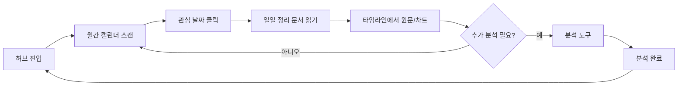

# AI 인텔리전스 허브 전면 개편안

> StockMind — 버전 초안 · 2026-05-31  
> 목적: **분석 도구**에서 **캘린더·일일 정리·정량 대시보드 중심의 인텔리전스 허브**로 전환

---

## 1. 배경과 문제

### 1.1 현재 상태

| 항목 | 현재 |
|------|------|
| 기본 화면 | `분석 요청` 탭 (`pageTab` 기본값 `analyze`) |
| 구조 | 단일 페이지(`intelligence/page.tsx` 1,300줄+)에 7개 탭 혼재 |
| 일별 브리핑 | `GET /api/intel/daily` — **건수·감성·토픽 집계**만 제공 |
| 이슈 데이터 | `MacroSignal` / `SectorSignal` / `StockSignal` / `StockIssue` (`event_date`) |
| 원본 분석 | `IntelContent` (YouTube·뉴스·텍스트) |

### 1.2 사용자 요구 (3가지)

1. **첫 화면 = 캘린더** — 월·주·일 단위로 이슈를 한눈에
2. **일일 정리 문서** — 하루가 지나면 AI가 그날을 요약한 **문서**를 만들고, **일 뷰** 상단에 표시
3. **분석 메뉴 후순위** — 허브는 **분석한 데이터를 정량적으로 보는 대시보드**, 분석 입력은 보조

### 1.3 개편 원칙

- **소비(읽기) 우선, 생산(분석) 후순위**
- **날짜가 축** — 모든 이슈·신호·분석을 캘린더에 올린다
- **기존 DB·Signal·차트 연동 재사용** — 신규 분석 파이프라인과 호환
- **단계적 출시** — 캘린더 → 일일 digest → 탭 재배치·KPI

---

## 2. 목표 UX (Information Architecture)

### 2.1 정보 구조 (개편 후)

```
/intelligence                    ← 기본 진입 (캘린더 허브)
├── [기본] 캘린더 허브
│   ├── 뷰: 월 | 주 | 일
│   ├── 상단: 정량 KPI 스트립
│   └── 선택일 패널
│       ├── 일일 정리 문서 (AI digest)
│       └── 당일 이슈 타임라인
├── [서브] 인사이트
│   ├── 매크로 허브
│   ├── 섹터 허브
│   └── 포트폴리오 리마인드
└── [서브] 분석 도구  (/intelligence/tools 또는 접이식)
    ├── 분석 요청
    ├── 채널 구독
    └── 분석 이력
```

### 2.2 사용자 여정



---

## 3. 화면 설계

### 3.1 캘린더 허브 (기본 화면)

#### 3.1.1 상단 — 정량 KPI 스트립

| KPI | 설명 | 데이터 소스 |
|-----|------|-------------|
| 분석 건수 | 선택 기간 내 `IntelContent` 수 | `intel_contents` |
| Signal 건수 | 매크로+섹터+종목 Signal | `*_signals` |
| 감성 비율 | 긍정 / 중립 / 부정 % | Signal·Content `sentiment` |
| 활성 섹터 Top 3 | 언급·신호 많은 섹터 | `SectorSignal` |
| 내 종목 언급 | 포트·관심 종목 관련 건수 | `StockSignal.is_portfolio` + watchlist |
| 전일 대비 Δ | (선택) 건수·감성 변화 | 집계 API |

기간 토글: **7일 / 30일 / 90일** (KPI만; 캘린더 자체는 월 단위 네비게이션)

#### 3.1.2 뷰 — 월 (Month)

- 그리드: 일요일 시작 또는 월요일 시작 (로케일 `ko-KR`)
- 각 날짜 셀:
  - **밀도 점** 또는 **미니 바** (이슈 건수)
  - **감성 색**: 긍정(녹) / 부정(적) / 혼합(회색 테두리)
  - **digest 존재** 시 📄 아이콘
- 호버/탭: `분석 3 · 매크로 1 · 섹터 2 · 종목 5`
- 클릭 → **일 뷰**로 전환 + 해당일 선택

#### 3.1.3 뷰 — 주 (Week)

- 7열 (월~일 또는 선택 주의 7일)
- 각 열: 시간순 **이슈 칩** (최대 N개 + “+3”)
- 칩 색: 감성 / 아이콘: 유형(🌍 매크로 · 📊 섹터 · 📈 종목 · 🎬 분석)
- 열 헤더에 일별 건수·digest 유무

#### 3.1.4 뷰 — 일 (Day)

**레이아웃 (위 → 아래)**

1. **일일 정리 문서** (§4 참고)
   - 제목, 생성 시각, 마크다운 본문
   - 섹션: 매크로 요약 · 섹터 · 주요 종목 · 리스크·체크포인트
   - 액션: [재생성] [원문 근거 펼치기]

2. **당일 정량 요약** (기존 `DailyBriefing` stats를 카드로)
   - 분석 N건 · 매크로 · 섹터 · 종목 · 감성 분포

3. **이슈 타임라인**
   - 통합 이벤트 리스트 (시간/유형/감성/요약)
   - 클릭 → `IntelDetailPanel` 또는 차트(`/chart?symbol=`)

4. **필터 바** (선택)
   - 출처: YouTube / 뉴스 / 텍스트
   - 유형: 매크로 / 섹터 / 종목
   - 내 종목만 / 관심종목만

#### 3.1.5 날짜 기준 (중요 결정)

| 모드 | 필드 | 용도 |
|------|------|------|
| **사건일** (기본 권장) | `event_date` on Signals, StockIssue | 시장·차트와 정합, “그날 무슨 일이 있었나” |
| **분석일** (보조 토글) | `IntelContent.analyzed_at` | “그날 몇 개 분석했나” 운영 뷰 |

UI에 **「사건일 | 분석일」** 토글을 두어 혼동을 줄인다.

---

### 3.2 인사이트 (기존 탭 승격·정리)

현재 `macro` / `sectors` / `remind` 탭 내용을 **캘린더 아래 서브 네비** 또는 **우측 패널**로 유지.

- **매크로 허브**: 토픽별 Signal (기존 `GET /intel/macro`)
- **섹터 허브**: 섹터별·감성 (기존 `GET /intel/sectors`)
- **리마인드**: 보유·관심 종목 Signal (기존 `GET /intel/portfolio/remind`)

캘린더에서 섹터/매크로 칩 클릭 시 해당 허브로 딥링크.

---

### 3.3 분석 도구 (후순위)

| 메뉴 | 기존 | 변경 |
|------|------|------|
| 분석 요청 | 첫 탭 | `/intelligence/tools` 또는 「분석 도구」 접기 |
| 채널 구독 | 2번째 | 동일 |
| 분석 이력 | 3번째 | 동일 |
| 일별 브리핑 | 별도 탭 | **일 뷰 digest로 흡수** 후 탭 제거 |
| 매크로/섹터/리마인드 | 탭 | **인사이트**로 이동 |

분석 완료 후: **「허브로 돌아가기」** → 해당 `analyzed_at` 또는 `event_date` 일로 캘린더 포커스.

---

## 4. 일일 정리 문서 (Daily Digest)

### 4.1 정의

- **하루 단위**로, 대상일에 모인 모든 Signal·Issue·분석을 입력으로 **AI가 작성·저장**하는 **내러티브 문서**
- 기존 `DailyBriefing`(집계만)과 **별개 레이어**

### 4.2 데이터 모델 (신규)

**테이블: `intel_daily_digests`**

| 컬럼 | 타입 | 설명 |
|------|------|------|
| `id` | PK | |
| `date` | String(10) UNIQUE | YYYY-MM-DD |
| `title` | String | 예: "2026-05-30 시장·섹터 브리핑" |
| `body_markdown` | Text | AI 생성 본문 |
| `stats_json` | Text (JSON) | 건수, 감성, top_sectors, top_symbols |
| `source_content_ids` | Text (JSON) | 근거 `IntelContent.id[]` |
| `source_signal_ids` | Text (JSON) | (선택) 근거 signal id 묶음 |
| `portfolio_highlight` | Text (JSON) | (선택) 내 종목·관심 종목 요약 |
| `generated_at` | DateTime | |
| `model` | String | 예: gemini-3.1-flash-lite |
| `status` | String | `pending` \| `ready` \| `failed` |
| `error_message` | Text | 실패 시 |

### 4.3 생성 로직

**입력 수집 (대상일 `D`)**

- `MacroSignal.event_date == D`
- `SectorSignal.event_date == D`
- `StockSignal.event_date == D`
- `StockIssue.event_date == D` (+ 종목명)
- `IntelContent` where `published_at` or `analyzed_at` falls on D (보조)
- (선택) `PriceMoveCause` on D

**프롬프트 출력 구조 (예)**

```json
{
  "title": "...",
  "sections": [
    { "heading": "매크로", "body": "..." },
    { "heading": "섹터", "body": "..." },
    { "heading": "주요 종목", "body": "..." },
    { "heading": "리스크·체크리스트", "body": "..." }
  ],
  "portfolio_note": "..."
}
```

→ `body_markdown`으로 렌더 저장.

**트리거**

| 방식 | 시점 | 비고 |
|------|------|------|
| 자동 | 매일 00:30 KST, `D = 어제` | Render 등 **상시 서버** 권장 |
| 수동 | `POST /api/intel/digest/generate?date=` | UI 「이날 요약 생성」 |
| 백필 | `POST /api/intel/digest/backfill?from=&to=` | 과거 일괄 |

Vercel serverless만 쓰는 경우: 1단계는 **수동 생성** + 로컬 cron.

### 4.4 API

| Method | Path | 설명 |
|--------|------|------|
| GET | `/api/intel/digest?from=&to=` | 기간별 digest 목록 (캘린더 📄 표시용) |
| GET | `/api/intel/digest/{date}` | 해당일 문서 + stats |
| POST | `/api/intel/digest/generate` | 단일일 생성/재생성 |
| POST | `/api/intel/digest/backfill` | 기간 백필 (관리) |

기존 `GET /api/intel/daily`는 **deprecated** → digest `stats_json` + 이벤트 API로 대체.

---

## 5. 통합 캘린더 API

### 5.1 이벤트 모델 (API 응답)

```typescript
interface IntelCalendarEvent {
  id: string;              // "macro-12", "content-45"
  date: string;            // YYYY-MM-DD
  kind: "macro" | "sector" | "stock" | "content" | "issue" | "price_move";
  title: string;
  summary: string;
  sentiment: "POSITIVE" | "NEUTRAL" | "NEGATIVE" | null;
  sector?: string | null;
  symbol?: string | null;
  stock_name?: string | null;
  source_type?: string;    // YOUTUBE | NEWS | TEXT
  content_id?: number | null;
  source_url?: string | null;
  is_portfolio?: boolean;
  is_watchlist?: boolean;
}
```

### 5.2 엔드포인트

**`GET /api/intel/calendar`**

| Query | 설명 |
|-------|------|
| `from`, `to` | YYYY-MM-DD |
| `date_mode` | `event` (default) \| `analyzed` |
| `kinds` | comma-separated filter |
| `portfolio_only` | bool |
| `watchlist_only` | bool |

**응답**

```json
{
  "from": "2026-05-01",
  "to": "2026-05-31",
  "date_mode": "event",
  "days": {
    "2026-05-30": {
      "event_count": 12,
      "sentiment": { "POSITIVE": 5, "NEUTRAL": 4, "NEGATIVE": 3 },
      "has_digest": true,
      "events": []
    }
  },
  "digests": {
    "2026-05-30": { "title": "...", "status": "ready" }
  }
}
```

월/주 뷰는 `days` 메타만 내려받고, 일 뷰에서 `events` 풀 리스트 로드 (성능 분리 가능).

**`GET /api/intel/calendar/day?date=YYYY-MM-DD`**

- 해당일 `events[]` 전체 + digest 본문 (일 뷰 전용)

---

## 6. 프론트엔드 구조 (리팩터링)

### 6.1 파일 분리

```
frontend/
├── app/intelligence/
│   ├── page.tsx                 # 허브 셸 (캘린더 기본)
│   └── tools/page.tsx           # 분석 도구 (선택)
├── components/intelligence/
│   ├── intel-calendar-hub.tsx   # 월/주/일 + KPI
│   ├── intel-month-grid.tsx
│   ├── intel-week-board.tsx
│   ├── intel-day-panel.tsx      # digest + timeline
│   ├── intel-kpi-strip.tsx
│   ├── intel-insights-nav.tsx   # macro / sectors / remind
│   ├── intel-tools/             # analyze, channels, history
│   └── intel-detail-panel.tsx   # 기존 재사용
└── lib/
    └── intelCalendar.ts         # API 타입·fetch
```

### 6.2 상태 관리

- `viewMode`: `month` | `week` | `day`
- `focusDate`: ISO date
- `dateMode`: `event` | `analyzed`
- `calendarRange`: from/to (월 이동 시 갱신)

### 6.3 네비게이션 변경

`app-shell.tsx` — 「AI 분석」 라벨 유지 또는 **「인텔리전스」** 로 변경 (선택).

---

## 7. 백엔드 작업 목록

### 7.1 Phase 1 — 캘린더 (MVP)

- [ ] `core/intel_calendar.py` — Signal·Issue·Content → `IntelCalendarEvent` 집계
- [ ] `GET /api/intel/calendar`
- [ ] `GET /api/intel/calendar/day` (선택, 일 뷰 상세)
- [ ] DB migration: (없음, 기존 테이블만)
- [ ] 프론트: 월/주/일 UI, KPI 스트립
- [ ] 기본 탭 → 캘린더 허브
- [ ] `date_mode` 토글

### 7.2 Phase 2 — Daily Digest

- [ ] `IntelDailyDigest` 모델 + migration
- [ ] `core/intel_digest.py` — 수집 + Gemini 생성
- [ ] `GET/POST` digest API
- [ ] 일 뷰 상단 digest 렌더 (markdown)
- [ ] 스케줄 job (Render) 또는 수동 버튼
- [ ] `intel/daily` deprecated 안내

### 7.3 Phase 3 — IA 정리 & 대시보드

- [ ] 분석 도구 → `/intelligence/tools` 또는 접이식
- [ ] macro/sectors/remind → 인사이트 서브
- [ ] 분석 완료 → 허브 해당일로 리다이렉트
- [ ] README·API 문서 갱신

### 7.4 Phase 4 — 고도화

- [ ] 관심종목·포트 필터 on 캘린더
- [ ] digest 품질 (근거 링크, hallucination guard)
- [ ] 주간 digest (선택)
- [ ] 데모 모드: digest 샘플/비공개 분석 분리
- [ ] 캐시·페이지네이션 (90일+)

---

## 8. 비기능 요구

| 항목 | 목표 |
|------|------|
| 캘린더 30일 로드 | < 500ms (로컬 SQLite) |
| 일 뷰 이벤트 50건 이하 | 한 번에 렌더 |
| Digest 생성 | 1일 1회, 타임아웃 60s, 실패 시 `failed` + 재시도 |
| AI 비용 | digest는 **일 1회** — Signal 재사용으로 분석 호출 최소화 |
| 면책 | digest·캘린더 UI에 「참고용, 투자 권유 아님」 유지 |

---

## 9. 기존 기능과의 관계

| 기능 | 개편 후 |
|------|---------|
| YouTube 분석·채널 | 분석 도구로 이동, 완료 후 허브 반영 |
| Signal 백필 | 유지 — 캘린더·digest 입력 |
| 차트 `event_date` 마커 | `event_date` 기준 캘린더와 동일 축 |
| buy-score / shared-signals | 변경 없음 |
| 관심종목 | 캘린더 `is_watchlist` 필터 |
| 데모 모드 | 포트는 가짜, **IntelContent는 공개 시 노출 주의** — 데모 DB 분리 권장 |

---

## 10. 리스크와 대응

| 리스크 | 대응 |
|--------|------|
| `analyzed_at` vs `event_date` 불일치 | UI 토글 + digest 프롬프트에 both 명시 |
| Vercel DB 휘발 | digest·캘린더 데이터도 날아감 → 영구 DB |
| digest 환각 | 근거 id 목록·원문 링크 필수, stats는 DB 집계만 |
| 페이지 비대 | 컴포넌트 분리·lazy load 일 뷰 |
| 개발 공수 | Phase 1만으로도 체감 큰 개편 가능 |

---

## 11. 성공 지표 (제안)

- 허브 진입 후 **분석 탭 이동 비율** 감소, **일 뷰 체류** 증가
- **digest 생성일 수** / 주간 재방문
- 캘린더에서 **차트·원문 클릭률**

---

## 12. 오픈 질문 (결정 필요)

1. 캘린더 기본 날짜: **사건일** vs **분석일** (권장: 사건일)
2. digest에 **내 포트/관심 전용 섹션** 포함 여부
3. digest 자동화: Render cron vs 수동만 1차
4. `/intelligence/tools` 분리 라우트 vs 단일 페이지 접이식
5. 주간·월간 AI 요약 문서 필요 여부 (2차)

---

## 부록 A — 현재 API 매핑

| 기존 | 개편 후 |
|------|---------|
| `GET /intel/daily` | → `GET /intel/digest` + `GET /intel/calendar` |
| `GET /intel/macro` | 인사이트 탭 유지 |
| `GET /intel/sectors` | 인사이트 탭 유지 |
| `GET /intel/portfolio/remind` | 인사이트 탭 유지 |
| `POST /intel/analyze` | 분석 도구 |
| `POST /intel/signals/backfill` | 설정·도구에 유지 |

---

## 부록 B — 참고 코드 위치

| 경로 | 내용 |
|------|------|
| `frontend/app/intelligence/page.tsx` | 현재 monolith UI |
| `backend/api/routes_signals.py` | `get_daily_briefing` |
| `backend/config/database.py` | IntelContent, *Signal, StockIssue |
| `frontend/lib/api.ts` | `DailyBriefing`, `signalApi` |
| [AI 분석 · 저장 · 차트 연동](AI-분석-저장-차트연동.md) | Signal·차트 연동 |

---

*문서 끝*
