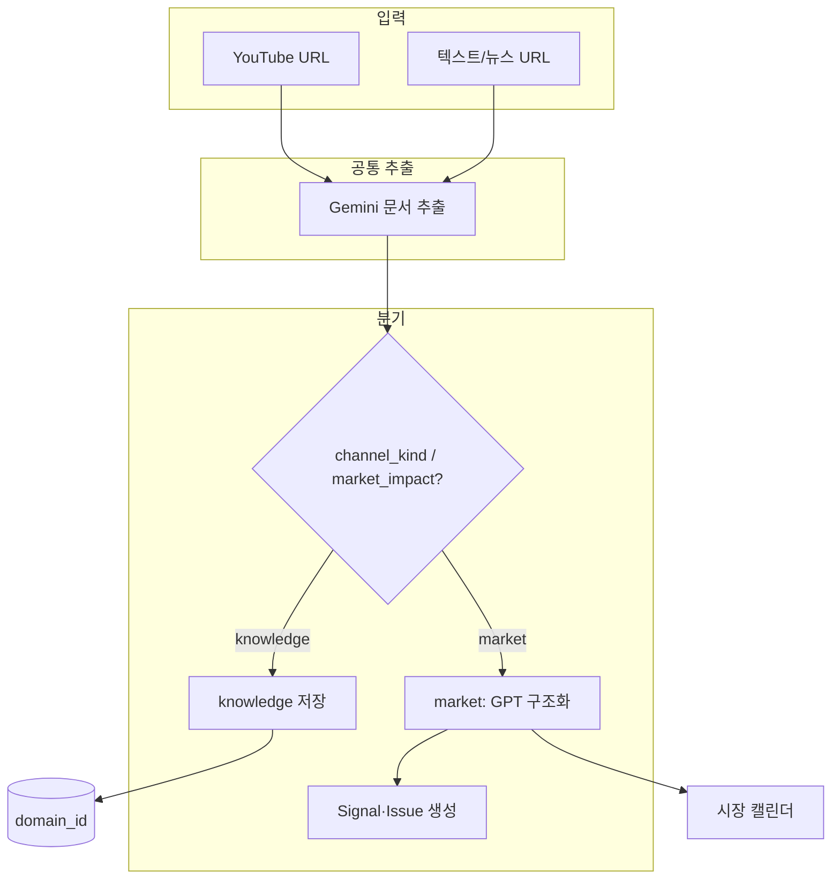

# 지식 허브 (Knowledge Hub) 요구사항

> StockMind — 버전 초안 · 2026-05-31  
> 목적: **주가 반영 인텔리전스**와 분리된 **「지식」 카테고리**를 설계하고, 사용자의 **관심 분야별 정보 수집·탐색·(선택) 뉴스 자동 수집** 요구를 정의한다.

---

## 1. 배경과 현재 상태

### 1.1 제품 맥락

StockMind는 기본적으로 **포트폴리오·시장·Signal·캘린더** 중심의 주식 인텔리전스 대시보드다.  
동시에 사용자는 투자와 무관하거나 약하게 연관된 **다양한 관심 분야**(기술, 건강, 교육, 취미, 산업 트렌드 등)의 YouTube·텍스트·뉴스도 같은 파이프라인으로 모으고 싶어 한다.

### 1.2 이미 구현된 것 (기술 기반)

| 항목 | 현재 동작 | 한계 |
|------|-----------|------|
| `content_scope` | `market` \| `knowledge` — 주가 Signal·매크로·캘린더(시장)에서 제외 | **「분야」 개념 없음** — 지식이 한 덩어리 |
| YouTube 채널 | `default_market_impact=false` → 지식 분석(요약·문서만) | 채널이 **시장 허브와 UI·탭이 혼재** |
| 분석 파이프라인 | Gemini 추출 → (market만) GPT 구조화·Signal | 지식도 **수집 방식은 동일**하나 **소비 UX가 없음** |
| 인텔 허브 | 캘린더·일일 digest·매크로/섹터 — **market 중심** | 지식 콘텐츠가 **허브에 잘 보이지 않음** |
| 뉴스 | `move_explainer` 등 **종목·급변일 중심** Google News RSS | **관심 분야 일반 뉴스** 미지원 |

### 1.3 이번 요구의 핵심 전환

- **지식 = 주가 반영의 부정 옵션**이 아니라, **독립 카테고리(허브)** 로 승격한다.
- 수집(YouTube·텍스트·URL) 방식은 **주가 반영과 동일한 파이프라인**을 재사용한다.
- 소비(읽기)는 **관심 분야(도메인)별**로 나누어 보여 준다.
- (선택) 분야별 **뉴스 자동 수집·요약**으로 관심을 충족한다.

---

## 2. 목표와 비목표

### 2.1 목표

1. 사용자가 **관심 분야를 여러 개 등록**하고, 분야마다 콘텐츠·채널·(선택) 뉴스를 묶어 본다.
2. **지식 채널**을 시장 채널과 구분해 등록·관리한다.
3. 지식 콘텐츠는 **매크로·Signal·포트폴리오 캘린더에 섞이지 않는다**.
4. 분야별 **피드·타임라인·검색**으로 “내가 궁금한 여러 영역”을 한 앱에서 탐색한다.
5. (Phase 2+) 분야 키워드 기반 **뉴스 자동 수집·요약**을 제공한다.

### 2.2 비목표 (초기 범위 밖)

- 소셜·커뮤니티, 댓글, 공유 타임라인
- 지식 콘텐츠의 주가 예측·Signal 생성
- 전문 지식 그래프·온톨로지 자동 구축
- 유료 뉴스 API 대량 구독 (초기는 RSS·공개 검색 위주)

---

## 3. 사용자 페르소나·시나리오

### 3.1 페르소나

**관심이 넓은 개인 투자자 겸 학습자**

- 투자: 시장 캘린더·Signal·포트폴리오 (기존 StockMind)
- 비투자/준투자: AI, 반도체 산업, 건강, 자기계발 YouTube 등 **여러 채널을 구독**
- 원하는 것: “주식 앱을 켜도 **시장만 보는 게 아니라**, 내가 등록한 **분야별 최신 정리**를 보고 싶다.”

### 3.2 대표 시나리오

| # | 시나리오 | 기대 결과 |
|---|----------|-----------|
| S1 | 「AI·반도체·매크로경제」3개 분야를 등록 | 허브에 3개 카드/탭으로 분리 표시 |
| S2 | 교육용 YouTube 채널을 **지식 채널**로 등록 | 새 영상 분석 시 해당 **분야**에만 쌓임 |
| S3 | 예전에 주가 반영으로 분석된 영상 | **지식으로 이동** 또는 분야 재태깅 |
| S4 | 아침에 앱 실행 | **분야별 최신 3건 + (선택) 분야 뉴스 헤드라인** |
| S5 | 시장 캘린더 조회 | 지식 콘텐츠·교육 영상 **미표시** |

---

## 4. 개념 모델

### 4.1 용어 정의

| 용어 | 정의 |
|------|------|
| **시장 인텔** (Market Intel) | `content_scope=market` — Signal, 매크로, 섹터, 포트폴리오 연동, 시장 캘린더 |
| **지식 인텔** (Knowledge Intel) | `content_scope=knowledge` — 요약·핵심 포인트·추출 문서 중심, 시장 파생 데이터 없음 |
| **관심 분야** (Knowledge Domain) | 사용자 정의 카테고리. 예: `AI`, `반도체`, `건강`, `거시경제` |
| **지식 채널** | YouTube(또는 추후 RSS) 소스. **반드시 하나의 관심 분야에 소속** |
| **지식 콘텐츠** | 분석 완료된 `IntelContent` (지식 scope + domain_id) |
| **분야 뉴스** (선택) | domain에 연결된 키워드·RSS로 수집한 뉴스 아이템 |

### 4.2 시장 vs 지식 (제품 관점)

```
┌─────────────────────────────────────────────────────────────┐
│                      StockMind 앱                            │
├──────────────────────────┬──────────────────────────────────┤
│   시장 인텔리전스 허브      │        지식 허브 (신규)            │
│   /intelligence (market)   │   /knowledge 또는 /intelligence/   │
│                            │        knowledge                   │
│ · 캘린더·Signal·digest      │ · 분야별 피드·타임라인              │
│ · 매크로/섹터/포트폴리오     │ · 지식 채널 관리                    │
│ · 주가 반영 YouTube         │ · (선택) 분야 뉴스                 │
└──────────────────────────┴──────────────────────────────────┘
              │                              │
              └──────────┬───────────────────┘
                         ▼
              공통: IntelContent + 분석 파이프라인
              (추출·요약); market만 구조화·Signal
```

### 4.3 관심 분야와 채널 관계

- **1 Domain : N Channels** (한 분야에 여러 YouTube 채널)
- **1 Channel : 1 Domain** (채널은 단일 분야; 변경 시 기존 콘텐츠 정책은 §7.4)
- **1 Content : 1 Domain** (분석 시 채널의 domain 상속; 수동 변경 가능)

---

## 5. 기능 요구사항

### 5.1 관심 분야 (Knowledge Domain) 관리

| ID | 요구사항 | 우선순위 |
|----|----------|----------|
| KD-01 | 사용자가 분야 **생성·수정·삭제·정렬** 가능 | P0 |
| KD-02 | 분야 속성: `name`, `slug`, `icon`/`emoji`, `color`, `description`(선택) | P0 |
| KD-03 | 분야별 **키워드 목록** (뉴스·검색용, 쉼표 또는 태그) | P1 |
| KD-04 | 분야 **활성/비활성** — 비활성 시 피드에서 숨김, 데이터 유지 | P1 |
| KD-05 | 기본 분야 템플릿 제공 (예: 기술, 경제, 건강, 투자교육) — 선택 적용 | P2 |

### 5.2 지식 채널 관리

| ID | 요구사항 | 우선순위 |
|----|----------|----------|
| KC-01 | YouTube 채널 등록 시 **「지식 채널」** 로 명시, **관심 분야 필수 선택** | P0 |
| KC-02 | 시장용 채널 등록 UI와 **분리** (시장 허브의 「주가 반영」 채널 vs 지식 허브의 「지식 채널」) | P0 |
| KC-03 | 채널 삭제·재등록 시 **등록 폼 설정 반영** (default_market_impact, domain_id) | P0 |
| KC-04 | 채널 카드에 **분야 뱃지** 표시 | P0 |
| KC-05 | 채널 재등록(지식) 시 **기존 분석 일괄 지식 처리·분야 매핑** 옵션 | P1 |
| KC-06 | (선택) 채널별 자동 분석 스케줄 — market 채널과 동일 정책, scope만 knowledge | P2 |

### 5.3 지식 콘텐츠 수집·분석

| ID | 요구사항 | 우선순위 |
|----|----------|----------|
| KA-01 | YouTube: Gemini 문서 추출 + **요약·key_points·keywords** (현행 `_save_knowledge_content` 수준) | P0 |
| KA-02 | **매크로·섹터·StockSignal·StockIssue 생성 금지** | P0 |
| KA-03 | TEXT/NEWS URL 분석 시 **지식 모드** 선택 가능, domain 지정 | P1 |
| KA-04 | `force_reanalyze` 시에도 knowledge면 market 구조화 **호출 안 함** | P0 |
| KA-05 | 콘텐츠에 `domain_id` 저장, 목록·필터에 사용 | P0 |

### 5.4 지식 허브 UI (소비)

| ID | 요구사항 | 우선순위 |
|----|----------|----------|
| KU-01 | **지식 허브** 전용 진입점 (네비: 「지식」 또는 인텔리전스 하위 「지식」 탭) | P0 |
| KU-02 | **분야 칩/사이드바** — 선택한 분야만 피드 표시, 「전체」 옵션 | P0 |
| KU-03 | 분야별 **최신순 타임라인** (썸네일, 제목, 요약 2줄, 출처, 날짜) | P0 |
| KU-04 | 카드 클릭 → 상세: 요약, 핵심 포인트, 추출 문서 탭, 원문 링크 | P0 |
| KU-05 | 분야별 **간단 통계**: 이번 주 N건, 최근 채널 활동 | P1 |
| KU-06 | **검색**: 제목·요약·키워드·채널명 (분야 스코프 내) | P1 |
| KU-07 | **북마크·읽음** 표시 (선택) | P2 |
| KU-08 | 분야별 **주간 AI 다이제스트** (시장 digest와 별도 테이블·프롬프트) | P2 |

### 5.5 시장 인텔과의 경계

| ID | 요구사항 | 우선순위 |
|----|----------|----------|
| MB-01 | `intel_calendar`, `intel_digest`, Signal 백필·lead-lag 등 **market scope만** | P0 |
| MB-02 | 분석 이력 탭: **시장 / 지식** 필터 또는 탭 분리 | P0 |
| MB-03 | 「주가 반영 제외」= knowledge 전환은 유지; **분야 지정 유도** UI | P1 |
| MB-04 | 「주가 반영 적용」= market 전환 + Signal 재생성 (현행) | P0 |

### 5.6 분야 뉴스 (자동 수집)

| ID | 요구사항 | 우선순위 |
|----|----------|----------|
| KN-01 | 분야 `keywords`로 **Google News RSS** (또는 동등 공개 소스) 주기 수집 | P1 |
| KN-02 | 뉴스 아이템: 제목, 링크, 출처, 발행 시각, (선택) 1~2문장 AI 요약 | P1 |
| KN-03 | 지식 허브 분야 뷰 상단 **「분야 뉴스」** 스트립 (최신 5~10건) | P1 |
| KN-04 | 뉴스 → 「지식으로 저장」: URL 분석 파이프라인 연동 | P2 |
| KN-05 | 중복 URL·제목 유사도로 **디듀프** | P1 |
| KN-06 | 스케줄: 6~12시간마다 domain별 수집 (서버 스케줄러) | P1 |

---

## 6. 데이터 모델 (제안)

### 6.1 신규 테이블

#### `knowledge_domains`

| 컬럼 | 타입 | 설명 |
|------|------|------|
| id | PK | |
| name | string | 표시명 |
| slug | string unique | URL용 |
| icon | string? | emoji 또는 icon key |
| color | string? | UI 테마 |
| keywords | text (JSON) | 뉴스·검색 키워드 배열 |
| sort_order | int | 사용자 정렬 |
| is_active | bool | |
| created_at | datetime | |

#### `knowledge_news_items` (P1)

| 컬럼 | 타입 | 설명 |
|------|------|------|
| id | PK | |
| domain_id | FK | |
| title | string | |
| url | string unique | |
| source_name | string? | |
| published_at | datetime? | |
| summary | text? | AI 또는 RSS description |
| fetched_at | datetime | |

### 6.2 기존 테이블 확장

#### `youtube_channels`

| 컬럼 | 설명 |
|------|------|
| `channel_kind` | `market` \| `knowledge` (또는 `default_market_impact` 대체·병행) |
| `domain_id` | FK nullable — knowledge 채널일 때 필수 |

#### `intel_contents`

| 컬럼 | 설명 |
|------|------|
| `content_scope` | 유지: `knowledge` \| `market` |
| `domain_id` | FK nullable — knowledge일 때 권장 필수 |

#### `intel_knowledge_digests` (P2, 선택)

- `domain_id`, `period_start`, `period_end`, `body_markdown`, `created_at`

### 6.3 마이그레이션 정책

1. 기존 `default_market_impact=false` 채널 → `channel_kind=knowledge`, **미분류 domain**은 「일반」 기본 domain 생성 후 매핑.
2. `content_scope=knowledge` 인 `IntelContent` → 동일 domain 규칙.
3. **`init_db`에서 `default_market_impact=0`을 `1`로 덮어쓰는 마이그레이션 제거** (버그 수정).
4. 채널 재활성화 시 **요청 body의 `domain_id`, `default_market_impact` 반영**.

---

## 7. API 설계 (초안)

### 7.1 Domain

| Method | Path | 설명 |
|--------|------|------|
| GET | `/api/knowledge/domains` | 목록 |
| POST | `/api/knowledge/domains` | 생성 |
| PATCH | `/api/knowledge/domains/{id}` | 수정 |
| DELETE | `/api/knowledge/domains/{id}` | 삭제(soft) |

### 7.2 Feed

| Method | Path | 설명 |
|--------|------|------|
| GET | `/api/knowledge/feed?domain_id=&limit=&cursor=` | 지식 콘텐츠 피드 |
| GET | `/api/knowledge/domains/{id}/stats` | 분야 통계 |

### 7.3 Channels (지식 전용 또는 기존 확장)

| Method | Path | 설명 |
|--------|------|------|
| POST | `/api/youtube/channels` | body: `channel_kind=knowledge`, `domain_id` 필수 |
| PATCH | `/api/youtube/channels/{id}` | domain·kind 변경 |
| POST | `/api/youtube/channels/{id}/exclude-market-analyses` | 기존 URL 일괄 knowledge+domain (P1) |

### 7.4 Content

| Method | Path | 설명 |
|--------|------|------|
| PATCH | `/api/intel/contents/{id}` | `domain_id`, `content_scope` (현행 scope API 확장) |
| GET | `/api/knowledge/news?domain_id=` | 분야 뉴스 (P1) |
| POST | `/api/knowledge/news/fetch?domain_id=` | 수동 수집 트리거 |

---

## 8. UI·정보 구조 (IA)

### 8.1 권장 IA

```
앱 네비게이션
├── 차트 / 포트폴리오
├── 인텔리전스 (시장)     ← 기존 캘린더·Signal·주가 채널
└── 지식                  ← 신규
    ├── [기본] 분야 보드  (등록한 domain 카드 그리드)
    ├── 분야 상세         /knowledge/[slug]
    │   ├── 피드 (지식 콘텐츠)
    │   ├── 뉴스 스트립   (P1)
    │   └── 채널 목록
    └── 설정
        ├── 분야 관리
        └── 지식 채널 등록
```

### 8.2 분야 보드 (와이어프레임 설명)

- 상단: 「내 관심 분야」+ 분야 추가 버튼
- 그리드: 분야별 카드 — 이름, 이번 주 건수, 최신 1건 제목, 대표 채널 수
- 카드 클릭 → 분야 상세 피드

### 8.3 시장 인텔리전스 페이지와의 관계

- **옵션 A (권장)**: `/knowledge` 라우트 분리 — 인지 부담 최소
- **옵션 B**: `/intelligence` 상위 탭 `시장` \| `지식` — 코드 공유는 쉬우나 1,300줄+ 페이지 비대화 주의

---

## 9. 분석·수집 파이프라인 (공통 vs 분기)



---

## 10. 비기능 요구사항

| 항목 | 요구 |
|------|------|
| 성능 | 분야 피드 50건 페이지네이션, 1초 이내 목록 (로컬 SQLite 기준) |
| 비용 | 뉴스·digest는 domain 수 × 빈도 상한 (일 1회 digest 등) |
| 프라이버시 | 관심 분야·키워드는 사용자 DB 로컬/자체 호스팅, 외부 전송 최소화 |
| 접근성 | 분야 색상+아이콘으로 색만으로 구분하지 않음 |
| i18n | UI 한국어 우선, domain name 사용자 입력 |

---

## 11. 단계별 로드맵

### Phase 0 — 기반 정리 (선행, 1~2일)

- [ ] DB 마이그레이션 버그 수정 (`default_market_impact` 덮어쓰기 제거)
- [ ] 채널 재등록 시 설정·domain 반영
- [ ] `resolve_market_impact` 기본값 `False` 검토

### Phase 1 — 지식 카테고리 MVP (1~2주)

- [ ] `knowledge_domains` 테이블 + CRUD API
- [ ] YouTube `domain_id` + `channel_kind=knowledge` 등록
- [ ] `/knowledge` 피드 UI (분야 필터, 타임라인)
- [ ] 시장 이력과 지식 이력 UI 분리
- [ ] 기존 knowledge 콘텐츠 → 기본 domain 마이그레이션

### Phase 2 — 분야 뉴스 (1주)

- [ ] `knowledge_news_items` + RSS 수집 스케줄
- [ ] 분야 상세 상단 뉴스 스트립
- [ ] 키워드 관리 UI

### Phase 3 — 고도화 (선택)

- [ ] 분야별 주간 AI digest
- [ ] 북마크·읽음·검색
- [ ] 뉴스 → 원클릭 지식 저장
- [ ] RSS/뉴스레터 소스 타입 확장

---

## 12. 성공 지표 (KPI)

| 지표 | 설명 |
|------|------|
| 등록 분야 수 | 사용자당 활성 domain ≥ 2 |
| 지식 주간 소비 | 지식 피드 상세 조회 / WAU |
| 시장 오염률 | knowledge 콘텐츠가 Signal·시장 캘린더에 노출된 건수 = 0 |
| 뉴스 클릭률 (P1) | 분야 뉴스 CTR |
| 채널 재등록 성공률 | 재등록 후 domain·scope 기대값 일치 |

---

## 13. 리스크·결정 사항

| 주제 | 선택지 | 권장 |
|------|--------|------|
| 라우팅 | `/knowledge` vs 인텔 탭 | `/knowledge` 분리 |
| 채널 모델 | `default_market_impact` vs `channel_kind` | 장기 `channel_kind` + domain_id |
| 미분류 지식 | 「일반」 domain 자동 생성 | 예 |
| domain 변경 시 기존 콘텐츠 | 일괄 이동 vs 신규만 | 사용자 확인 후 일괄 이동 |
| 투자 교육 채널 | 지식 vs 시장 | 사용자 선택, 기본 지식 |
| 뉴스 저작권 | 요약+링크만 저장 | move_explainer와 동일 원칙 |

### 13.1 미결 질문 (제품 오너 확인)

1. 분야 최대 개수 제한? (예: 20개)
2. 지식 허브도 **일별 캘린더**가 필요한가, 아니면 **피드만**으로 충분한가?
3. 분야 간 **콘텐츠 복제 허용** (하나의 영상을 2개 분야에) 여부?
4. 뉴스 키워드에 **영문/한글** 자동 변환 필요 여부?

---

## 14. 기존 문서·코드 참조

| 문서/코드 | 관련 내용 |
|-----------|-----------|
| `docs/AI-인텔리전스-허브-전면개편안.md` | 시장 허브 캘린더·digest |
| `backend/core/content_scope.py` | knowledge ↔ market 전환 |
| `backend/core/ai_analyzer.py` | `_save_knowledge_content` |
| `frontend/app/intelligence/page.tsx` | 채널·이력 UI (분리 대상) |
| `backend/core/move_explainer.py` | Google News RSS 패턴 참고 |

---

## 15. 요약

**지식 허브**는 StockMind 안의 **두 번째 축**이다. 수집은 시장과 같은 AI 파이프라인을 쓰되, **관심 분야별로 묶어 보여 주는 독립 카테고리**이며 시장 Signal·캘린더와 **완전히 분리**한다.  
MVP는 **분야 CRUD + 지식 채널·피드**이고, 다음 단계에서 **분야 키워드 뉴스 자동 수집**으로 “내 관심의 여러 분야를 한곳에서 채우는” 경험을 완성한다.

---

*문서 변경 이력: 2026-05-31 초안 작성*
